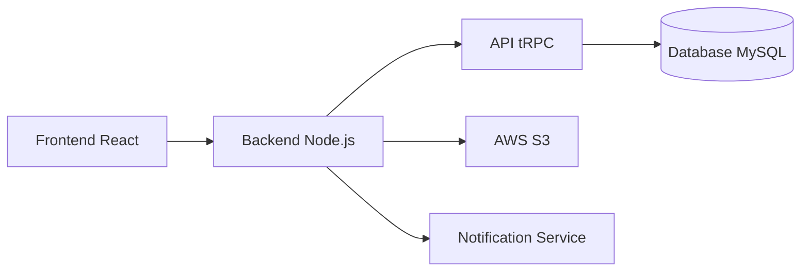

# Sport Accreditation Platform

Plataforma completa para gestão de credenciamento de colaboradores em eventos esportivos.

O sistema permite que equipes técnicas, fornecedores e administradores gerenciem o processo de credenciamento de forma automatizada, garantindo controle de acesso, auditoria completa e organização operacional dos eventos.

---


# Visão Geral

Em eventos esportivos é comum a participação de centenas de profissionais:

- equipes técnicas
- produtores
- fornecedores
- imprensa
- staff operacional

Gerenciar o credenciamento manualmente gera problemas como:

- inconsistência de dados
- falta de rastreabilidade
- atrasos na liberação de credenciais
- dificuldade de controle por fornecedor

Esta plataforma foi desenvolvida para **automatizar todo o fluxo de credenciamento**.

---

# Principais Funcionalidades

## Gestão de Usuários

Controle de acesso baseado em perfis (RBAC):

Admin  
- gerenciamento completo do sistema
- criação de eventos
- aprovação de credenciamentos

Fornecedor  
- cadastro de colaboradores
- solicitação de credenciamento

Consulta  
- acesso apenas para visualização

---

## Gestão de Eventos

Cadastro completo de eventos esportivos com:

- nome
- data
- local
- federação
- tipo de evento

O sistema também controla automaticamente o status do evento:

- aberto
- em verificação
- extraído
- enviado
- concluído

---

## Gestão de Colaboradores

Cadastro completo com:

- validação de CPF
- vínculo com fornecedor
- função operacional
- upload de documentos
- foto do colaborador
- informações de veículos

---

## Sistema de Credenciamento

Permite vincular colaboradores a eventos e acompanhar o processo de aprovação.

Status possíveis:

- pendente
- aprovado
- rejeitado
- credenciado

O sistema também valida automaticamente **limites de colaboradores por função** definidos para cada evento.

---

## Importação e Exportação de Dados

O sistema suporta operações em lote:

Importação:

- upload de planilhas Excel ou CSV
- validação automática de CPF e email
- relatório detalhado de erros

Exportação:

- relatórios de colaboradores
- relatórios de credenciamento
- layouts personalizados em Excel

---

## Auditoria Completa

Todas as ações são registradas automaticamente:

CREATE  
UPDATE  
DELETE  
UPLOAD  
SET_LIMIT  

Cada registro contém:

- usuário
- data e hora
- IP
- user-agent
- detalhes da alteração em JSON

Isso permite rastrear completamente o histórico do sistema.

---

## Sistema de Notificações

O sistema envia notificações automáticas baseadas no cronograma do evento.

D-10  
Abertura de cadastro para fornecedores

D-4  
Alerta de fechamento iminente

D-3  
Liberação das credenciais

Também são enviadas notificações quando ocorre:

- aprovação
- rejeição
- alteração de status

---

# Arquitetura do Sistema



---

# Stack Tecnológica

Frontend

React 19  
TypeScript  
Tailwind CSS  

Backend

Node.js  
Express  
tRPC  

Banco de dados

MySQL / TiDB  
Drizzle ORM  

Infraestrutura

AWS S3  
JWT Authentication  
OAuth (Manus)

Testes

Vitest

---

# Estrutura do Projeto

```
sportv-credenciamento
│
client/        frontend React
server/        backend Node.js
shared/        código compartilhado
drizzle/       schema e migrações
storage/       integração com S3
```

---

# Fluxo Operacional Automatizado

O sistema automatiza o cronograma de credenciamento.

D-10  
Abertura do cadastro para fornecedores

D-4  
Encerramento do prazo de cadastro

D-3  
Liberação das credenciais aprovadas

Dia do evento  
Credenciais válidas para acesso

---

# Testes Automatizados

O sistema possui cobertura de testes para os principais módulos:

Autenticação  
Controle de acesso (RBAC)  
CRUD de fornecedores  
CRUD de eventos  
CRUD de colaboradores  
Consulta pública  
Logs de auditoria  

Resultado atual:

22 / 22 testes passando

---

# Possíveis Evoluções

- geração de credenciais com QR Code
- exportação de credenciais em PDF
- dashboard analítico de eventos
- integração com serviços de email
- aplicativo mobile para consulta

---

# Sobre o Projeto

Sistema desenvolvido para otimizar o processo de credenciamento de colaboradores em eventos esportivos, reduzindo tarefas operacionais manuais e aumentando o controle e rastreabilidade das informações.
